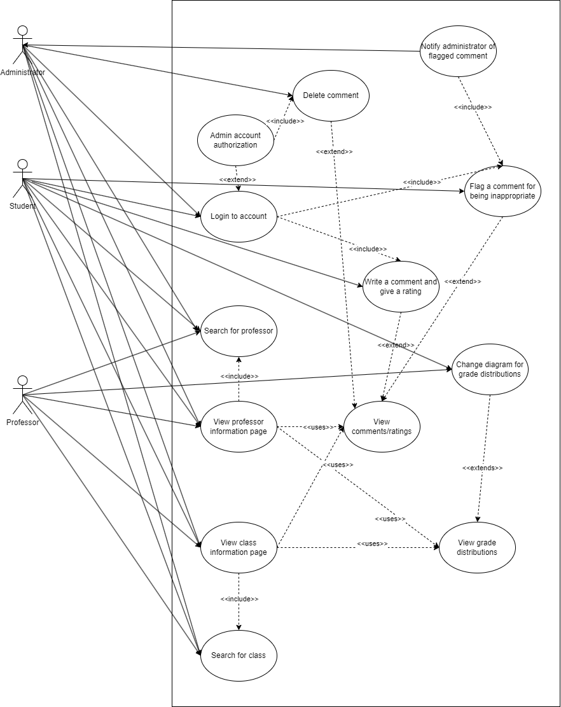
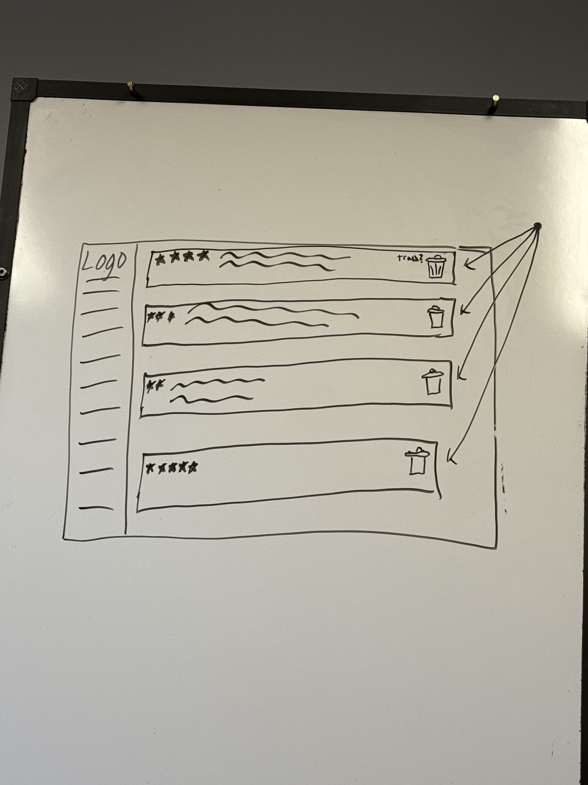
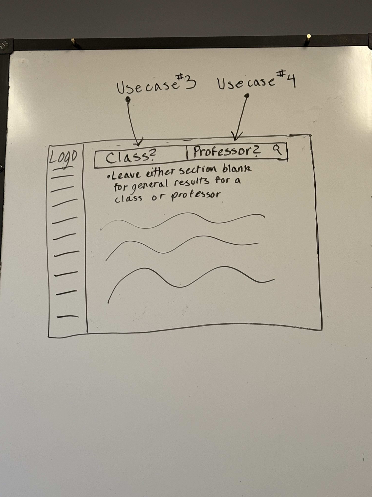
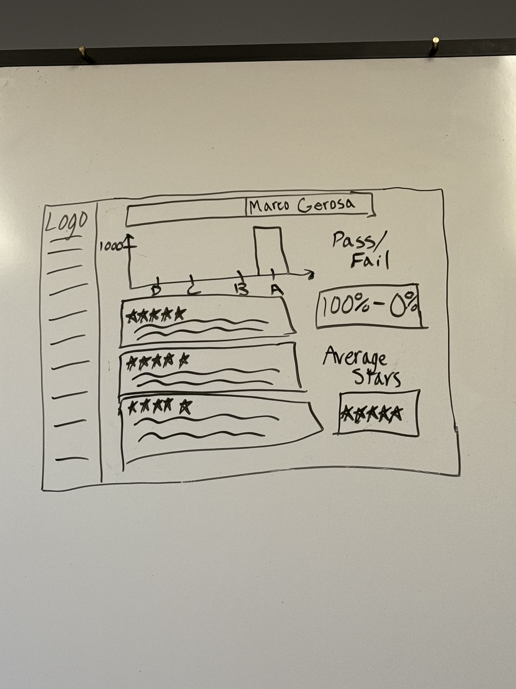

# Group 04 - “Louie’s Ratings”

**Group Members:** Jeffrey Hoelzel, Sean Golez, Luke Bowen, Ayla Tudor, John-Patrick Leis, Will Barnett

---

### **1\. Positioning**

*1.1 Problem statement*

The problem of information for future NAU class scheduling being difficult to find affects NAU Computer Science students; the impact of which is students walking into new school semesters unprepared and uninformed, leading to lower grades and enhanced stress.

*1.2 Product Position Statement*

For NAU Computer Science students who are looking to enhance their semesterly scheduling experience, Louie’s Ratings is a comprehensive data tool that allows CS students to not only view and examine professor reviews from previous semesters, but also the previous grade distributions in a graphical format; unlike RateMyProfessor, our product will offer more detailed information specialized to NAU classes and feature past grade distributions. 

*1.3 Value proposition and customer segment*

**Value proposition:** Louie’s Ratings is a website that allows NAU CS Students to feel more secure and informed about their enrollment decisions based off more accurate and readily available resources regarding the class and professor. 

**Consumer segment:** NAU CS students planning to enroll in courses for their next semester.

### **2\. Stakeholders**

- NAU faculty - Potential sponsers of Louie's Ratings, these stakeholders have a keen interest in ensuring the platform is fair and constructive instead of hurtful as Louie's Ratings may hurt the professional reputations of those they oversee.
- CS Professors - Computer science professors are an important stakeholder as they are those being directly rated and evaluated empirically by students. As such, these ratings may personally affect their reputations with students and even their overall job success. In contrast, this tool may be a valuable teacher for informing a professor of their weaknesses or strengths that may allow a professor to grow.  
- Incoming CS students - Incoming students are important stakeholders as they may use this software to make informed descisions on course selections for a whole semester period. This allows them to prepare for a semester that aligns with their own accademic goals and thus the software must be not only useful but accurate.  
- Returning CS students - Returning students may both utilize and contribute to Louie's Ratings as stakeholders. These students shape the website itself through their reviews they kindly put out to inform others. In turn, they utilitze other returning students reviews to select and/or prepare for their upper division classes.  
- RateMyProfessor - Albeit indirect, RateMyProfessor is an important stakeholder as it defines the unique features that give Louie's Ratings its value through competition. This competition is essential to making Louie's Ratings stand out on the market through its locally visualized theme. 
- Developers (us) - As the developers of Louie's Ratings, we are essential to not only building, but also maintaining the software and ensuring value to our users. We desire Louie's Ratings to be the user friendly platform that we envision, while also aligning with our needs as students and beneficiaries. 

### **3\. Functional requirements (features)**

1. Allows for users to enter ratings and comments - 5/5 priority
2. Displays comments, ratings, and grade distribution visualization on information pages 5/5
3. Search bar for professor pages - 4/5
4. Search bar for class pages - 4/5
5. User login system - 3/5  
6. Comments can be removed by administrators - 2/5

### **4\. Non-functional requirements**

1. Display scalability for different screen sizes to allow for website to be usable on multiple devices - 5/5 priority
2. Page framework is reused so that information is scalable - 5/5
3. For insights and comments, a comment should be able to be up to 255 characters or less in order to limit the size of information being stored and displayed 3/5
4. User authentication passwords should be RSA encoded for security 2/5
5. Limit users to one comment/insight per class section to prevent comments spamming 1/5

### **5\. MVP**

The minimal viable product based on our project inception will be a simple website with a homepage, grade distribution data specifically for CS professors, and an insight/comment section for our grade distribution data. The essential functionalities of our website will be tested by us, the developers, and a small sample of NAU students for feedback. We will be validating proper working order for the website and its basic functionalities (displaying grade distributions, searching for professors, and user comments).

### **6\. Use cases**

*6.1 Use case diagram*

****

*6.2 Use case descriptions and interface sketches*

**Use Case \#1:** Rating Professor

**Actor:** Student

**Trigger:** The student decides to rate a professor after completing a course.

**Pre-conditions:** 

1. The student is logged in to the system.  
2. The student states that they completed the course.

**Post-condition:** Student submits a rating for the professor that can be displayed.

**Success Scenario:**

1.  The student initiates a request to our app.  
2.  The student selects a professor to rate.  
3.  The system presents a 5-star rating scale and optional comment field.  
4.  The student selects a rating and optionally adds a comment.  
5.  The system validates the rating.  
6.  The system records the selected rating and updates the professor's overall rating.  
7.  The system confirms the successful submission back to the user.

**Alternate Scenario \#1:**

1. The student has already rated this professor.
2.  The system informs the student and offers to update the existing rating.  
3.  If the student chooses to update, continue from step 3 of the Success Scenario.

**Alternate Scenario \#2:**

1. Student cancels the operation.
2. The system discards the rating and returns to the course list.

**Alternate Scenario \#3:**

1. Invalid rating (e.g., no stars selected).
2. The system informs the student of the error and requests a valid rating.

**Interface Sketch:**

**Use Case \#2:** Remove comments/ratings  

**Actor:** Administrator  

**Trigger:** A student posts an inappropriate comment.

**Pre-conditions:** A student has to have posted a comment and rating for a professor. 

**Post-condition:** Comment and rating for professor are removed.  

**Success Scenario:**

1. Administrator logs into the system.
2. System displays flagged material for administrator review.
3. Administrator selects a comment to take action on.
4. System displays full comment and surrounding details like the professor and course it is associated with.
5. Administrator determines that a comment is a valid flag and must be removed from the site.
6. Administrator instructs the system to remove the comment.
7. System confirms this removal and updates the database to account for this removal. 

**Alternate Scenario \#1:**

1. Administrator examines the comment and determines it does not need to be removed.
2. Administrator has the system unflag the comment.

**Interface Sketch:**

**Use Case \#3:** Search class  

**Actor:** Student  

**Trigger:** Student wants to find information on a specific course.  

**Pre-conditions:** User is an NAU student.  

**Post-condition:** Student obtains sufficient information on a course to decide if they want to enroll. 

**Success Scenario:**

1. Student logs into Louie's Ratings.  
2. Student searches for a class.  
3. System displays a list of classes matching the user search.  
4. Student selects and confirms class that they’re searching for.
5. System displays the selected class' data.
6. Student reviews the class information.   
7. Student makes an informed decision on whether they want to enroll in the course.

**Alternate Scenario \#1:**

1. Student searches for the name of a class that Louie’s Ratings does not have information on.
2. System indicates that there is no information on the desired class.
3. Student verifies that their search grammar was correct.
4. Student searches for a new class.

**Alternate Scenario \#2:**

1. Student searches for a class and sees a dropdown of similar classes
2. Student reviews the displayed course names and course codes
3. Student selects the course they intended on searching
4. Students views selected course information displayed by the system

**Interface Sketch:**

**Use Case \#4:** Search professor  

**Actor:** Student  

**Trigger:** Student searches certain professors on website. 

**Pre-conditions:** Student has logged into the website and certain professor has data available on website.

**Post-condition:** Student views grade distributions and comments/insights associated with certain professor.

**Success Scenario:**

1. Student navigates to search bar/search page.
2. Student searches the system for a specific professor’s name.
3. System retrieves relevant professors and their associated data. 
4. Student selects correct professor from list.
5. System displays the specific professor's data.
6. Student views grade distributions and comments/insights associated with selected professor.
7. Student makes an informed decision on whether or not to enroll with a professor.

**Alternate Scenario \#1:**

1. Student enters searches the system for a specific professor.
1. System does not find any relevant matching professors.
2. System displays a message informing user that nothing was found.
3. Student double checks grammar.
4. Student searches for a new professor.

**Alternate Scenario \#2:**

1. Student selects correct professor from the list.
2. System indicates that selected professor does not have any comments/insights associated with them yet.
3. System displays grade distributions associated with the professor. 
4. Student views only the grade distributions and comments/insights.

**Interface Sketch:**

**Use Case \#5**: Login System

**Actor**: Student

**Trigger**: Student has selected the login prompt.

**Preconditions**: 

1. The student has registered with a valid @nau.edu address. 
2. The student enters their correct account credentials. 
3. The student has selected the login link.

**Post Conditions**: 

1. Takes user back to the main page. 
2. Any data entered by the user is stored.

**Success Scenario**:

1. The user navigates to the login option.  
2. The system prompts for required information.
3. The user then enters personal credentials and submits the information.  
4. The system validates these credentials.
5. The user logs in.  
6. The system refreshes the page.  
7. The user receives a welcome message.  

**Alternate Scenario \#1**:

1. The system rejects the credentials.
2. The system informs the user.
3. The system prompts the re-entry of credentials.
4. The user re-enters their credentials.

**Interface Sketch:**

**Use Case \#6:** View Professor/Class Information 
 
**Actor:** NAU Student  

**Trigger:** Student searches for the information and it is found in the database.  

**Pre-conditions:**

1. Student is authenticated in the system.  
2. System has information on the professor/class.

**Post-condition:**  
Student has views the requested information about a professor or class.

**Success Scenario:**

1. Student selects the class or professor they want to view.  
2. System retrieves and displays a list of matching results.  
3. System retrieves detailed information, including ratings and grade distributions.  
4. System provides an option to choose a display format (graph, pie chart, table, etc.).  
5. Student chooses their preferred display format.  
6. System presents the information in the chosen format.

**Alternate Scenario \#1:**

1. Student wants to change the display format after initial selection.
2. System provides options for different display formats.  
3. Student chooses an option to change the display format.  

**Alternate Scenario \#2:**

1. System is unable to retrieve the data.
2. System displays an error message to the student.  
3. System prompts the student to try again.  
4. Student selects a different class or professor.

**Interface Sketch:**

### **7\. User stories**

1. "As a student, I want to be able to see the grades the professor has given out before so that I can see the teacher's performance and make a more informed decision. "

    Priority: 5

    Time Estimate: 2.5 weeks
   
2. "As an NAU student, I want to read comments from other students who have taken the same class with different professors so that I can compare their experiences before I enroll."

    Priority: 5

    Time Estimate: 2 weeks

3. "As an incoming student, I want to look at different CS classes’ information so that I can decide if it’s the major that I’m interested in."

    Priority: 5

    Time Estimate: 2 weeks

4. "As a professor, I want to see what prior students have said about my teaching style so that I can adapt to the feedback and improve the performance of my classes."

    Priority: 4.5

    Time Estimate: 3 weeks

5. "As an NAU student, I want to see how many students withdrew from a course, so that I can gauge how difficult the course is expected to be."

    Priority: 4

    Time Estimate: 2 weeks

6. "As a system administrator, I want to be able to reliably catch any inappropriate comments within the database or directly on Louie’s Ratings so that the service remains professional."

    Priority: 3.5

    Time Estimate: 2 weeks

7. "As an NAU student, I want to be able to find information for every available class and professor so that I do not have to use any other sites to get my information."

    Priority: 3

    Time Estimate: 2 weeks

8. "As an administrator, I want users to be able to flag inappropriate comments so that I do not have to read through every comment."
    Priority: 3

    Time Estimate: 2 weeks

9. "As an administrator, I want to manage and update professor data so that the website stays up to date and reflects any changes in faculty."

    Priority: 3

    Time Estimate: 1 week

10. "As an upper-level student, I want to look at the descriptions of upper-level courses so that I can make an informed decision on which electives I want to take."

    Priority: 3

    Time Estimate: 1 week

11. "As a student TA, I want to be able to report overly biased negative comments and have them removed so that the information is reliabile and is not unecessarily hurtful to professors."

    Priority: 3

    TIme Estimate: 2 weeks

12. "As an incoming study abroad student, I want to know whether my professor is somewhat lenient so that I know if they will be accomomdating for the language barrier."

    Priority: 2

    Time Estimate: 2 weeks

### **8\. Issue Tracker**

[https://github.com/jeffreyHoelzel/LouiesRatings/issues](https://github.com/jeffreyHoelzel/LouiesRatings/issues)

