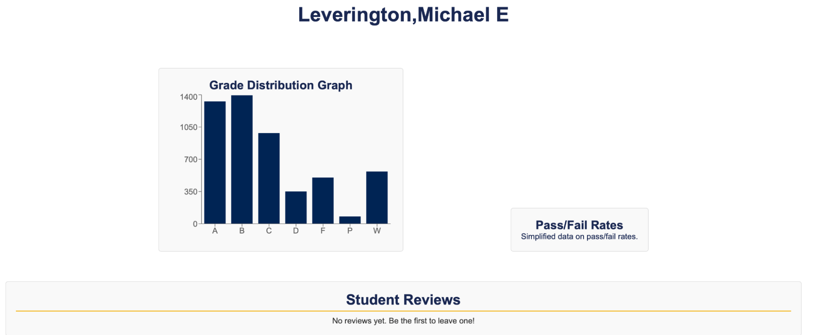

## **D.4 Implementation 1**

---

### **1. Introduction**

Louie’s Ratings is a comprehensive tool designed for NAU Computer Science students to enhance their semesterly scheduling experience. This platform allows students to view and analyze professor reviews from previous semesters, along with visual representations of grade distributions. By providing accurate and readily available resources, Louie’s Ratings empowers students to make informed enrollment decisions.

**GitHub Repository:** [Louie's Ratings](https://github.com/jeffreyHoelzel/LouiesRatings)

### **2. Implemented Requirements**

**Requirement:** As an NAU student, I want to read comments from other students who have taken the same class with different professors so I can compare their experiences before I enroll.  
- **Issue:** [#39](https://github.com/jeffreyHoelzel/LouiesRatings/issues/39)  
- **Pull Request:** [#54](https://github.com/jeffreyHoelzel/LouiesRatings/pull/54)  
- **Implemented by:** John-Patrick Leis  
- **Approved by:** Will Barnett  
- **Print Screen:** 

---

**Requirement:** As an incoming student, I want to look at different CS classes’ information so that I can decide if it’s the major that I’m interested in.  
- **Issue:** [#37](https://github.com/jeffreyHoelzel/LouiesRatings/issues/37)  
- **Pull Request:** [#56](https://github.com/jeffreyHoelzel/LouiesRatings/pull/56)  
- **Implemented by:** Ayla Tudor  
- **Approved by:** Luke Bowen  
- **Print Screen:** 

---

**Requirement:** As an incoming study abroad student, I want to make sure that my professor is somewhat lenient to help deal with the language barrier.  
- **Issue:** [#38](https://github.com/jeffreyHoelzel/LouiesRatings/issues/38)  
- **Pull Request:** [#46](https://github.com/jeffreyHoelzel/LouiesRatings/pull/46)  
- **Implemented by:** Luke Bowen  
- **Approved by:** Sean Golez and Will Barnett  
- **Print Screen:** 

---

**Requirement:** As an NAU student, I want to be able to find information for every available class and professor.  
- **Issue:** [#41](https://github.com/jeffreyHoelzel/LouiesRatings/issues/41)  
- **Pull Request:** [#55](https://github.com/jeffreyHoelzel/LouiesRatings/pull/55)  
- **Implemented by:** Will Barnett  
- **Approved by:** Sean Golez  
- **Print Screen:** 

---

**Requirement:** As a student, I want to be able to log into my own account to see which comments I’ve left.  
- **Issue:** [#36](https://github.com/jeffreyHoelzel/LouiesRatings/issues/36)  
- **Pull Request:** [#50](https://github.com/jeffreyHoelzel/LouiesRatings/pull/50)  
- **Implemented by:** Jeffrey Hoelzel  
- **Approved by:** Sean Golez and Luke Bowen  
- **Print Screen:** 

---

**Requirement:** As a student, I want to see the grades the professor has given out before to assess their performance and make a more informed decision.  
- **Issue:** [#40](https://github.com/jeffreyHoelzel/LouiesRatings/issues/40)  
- **Pull Request:** [#58](https://github.com/jeffreyHoelzel/LouiesRatings/pull/58)  
- **Implemented by:** Sean Golez  
- **Approved by:** Jeffrey Hoelzel  
- **Print Screen:** 

### **3. Tests**

We utilized `unittest` to develop our automated testing.  

**Test Cases:**  
One example is verifying that the professor's name displays correctly on the professor page.  
- **Test Link:** [Test Professor Page](https://github.com/jeffreyHoelzel/LouiesRatings/blob/main/unittest/test.py)  
- **Class Being Tested:** [ProfessorPage.js](https://github.com/jeffreyHoelzel/LouiesRatings/blob/main/web/src/components/ProfessorPage.js)

### **4. Adopted Technologies**

**Technologies and Justifications:**

- **Docker:** Allows for portable, consistent application deployment through containers.
- **Flask:** A lightweight web framework for Python, enabling easy asynchronous routing between the backend and frontend.
- **React:** A popular JavaScript library for building dynamic web applications, chosen for its ease of use and familiarity within the team.
- **SQLite (Development):** A self-contained SQL database engine, ideal for local testing without impacting the actual database.
- **PostgreSQL (Production):** A robust relational database system, well-suited for production use on DigitalOcean.

### **5. Learning/Training**

Our team enhanced our skills in the adopted technologies through individual research, collaborative discussions, and knowledge sharing. Team members with prior experience provided insights and assistance to those who had specific questions.

### **6. Deployment**

**Production Site:** [louiesratings.com](http://louiesratings.com)

Our application is hosted on DigitalOcean, running in Docker containers configured via Docker Compose. The architecture includes:
- **Service:** Backend functionality
- **Web:** Frontend interface
- **Test:** Automated unit tests
- **Proxy:** Facilitating internal communication and content delivery via an Apache-based server.

### **7. Licensing**

We chose the MIT license for its simplicity, allowing for commercial use, modification, distribution, and private use while maintaining copyright notices.

### **8. README File**

**LICENSE File:**  
[LICENSE](https://github.com/jeffreyHoelzel/LouiesRatings/blob/main/LICENSE)

**Code of Conduct File:**  
[Code of Conduct](https://github.com/jeffreyHoelzel/LouiesRatings/blob/main/CODE_OF_CONDUCT.md)

**Contributing File:**  
[Contributing](https://github.com/jeffreyHoelzel/LouiesRatings/blob/main/CONTRIBUTING.MD)

### **9. Look & Feel**

The user interface was designed to be intuitive and simple, reflecting NAU's branding through color and design choices. Course information closely mirrors NAU's course catalog, ensuring accessibility for students reviewing course details. The layout of professor pages prioritizes convenience, highlighting ratings for quick recognition.

 

### **10. Lessons Learned**

Our team realized that mastering new technologies takes more time than initially expected. Implementing learned concepts within the project context can be challenging. Moving forward, we aim to better estimate task durations during planning phases to ensure ample time for implementation and refinement of features.

### **11. Demo**
[Demo](https://nau.zoom.us/rec/share/t-7th-INeweUdweJ3QM-wvLx394eynzfEfFfY9Q-36QRCIaUtNVfPB2TOBdMtQ3J.sI0OVjcj_Eah83lQ?startTime=1730098365000)