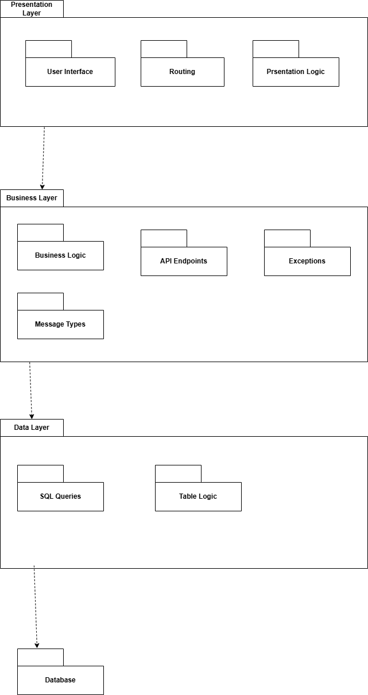
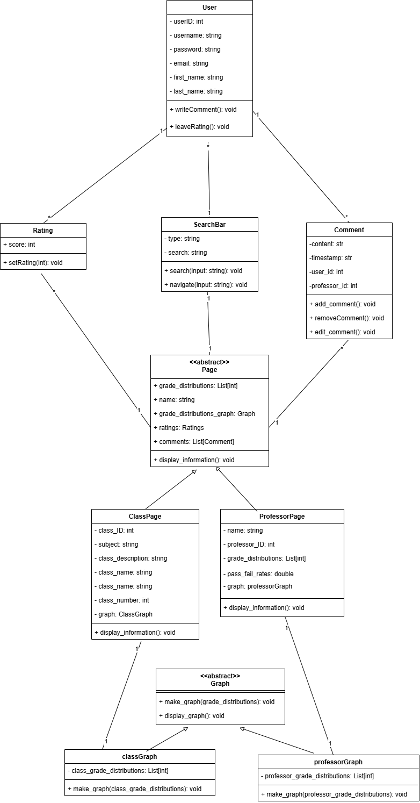
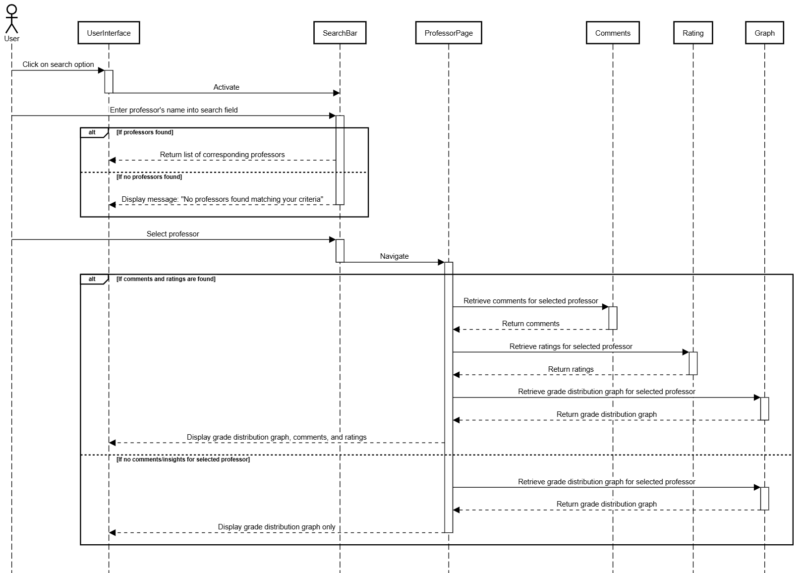
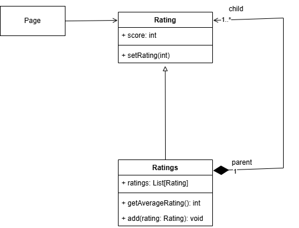

## **D.5 Design**

### **1. Description**

Louie’s Ratings is a website designed to help NAU students make more informed decisions when scheduling their classes. The platform provides professor and class reviews, visual graphs of grade distributions, and a comment section to share insights. Users can search for classes and professors to view relevant data, helping them plan for future semesters with less stress. A login system allows users to create accounts linked to their NAU email and major, giving them access to additional features like rating and commenting on courses.

The website includes a comment and rating system for users to share insights and feedback, creating a collaborative resource for current and future students. An insight board offers a space where users can ask questions or leave helpful tips about specific classes or professors. While the insight board is accessible to view for all users, only those logged in can actively contribute. Furthermore, only admins have the authority to delete comments. This combination of resources ensures that students are better prepared for their semesterly planning.

---

### **2. Architecture**

The architecture is designed this way because in our system, each layer is running in a separate container, so they are each packaged separately and interact with each other. The user interacts with the presentation layer, which is the front end of the application, with different inputs that the user can enter. Then, the presentation layer routes the request to the business layer, which sets up the routing endpoints and logic for each point. Then, the business layer retrieves information for the Data layer, which uses SQL queries to get data from the database, and that information is relayed back up the layers to the user.

**Architecture Diagram:**

---

### **3. Class Diagram**

---

### **4. Sequence Diagram**

**Use Case #4: Search professor**  
**Actor:** Student  
**Trigger:** Student searches certain professors on website  
**Pre-conditions:**  
- Student has logged into the website  
- Certain professor has data available on website  

**Post-condition:**  
- Student views grade distributions and comments/insights associated with certain professor  

**Success Scenario:**

1. Student navigates to search bar/search page  
2. Student enters professor’s name into search field  
3. System retrieves relevant professors and their associated data  
4. Student selects correct professor from list  
5. Student views grade distributions and comments/insights associated with selected professor

**Alternate Scenario #1:**

3a. System does not find any matching professors based on search criteria  
- System displays message informing user that nothing was found

**Alternate Scenario #2:**

5a. Selected professor does not have any comments/insights associated with them yet.  
- Student only views grade distributions and comments/insights

**Sequence Diagram:**

---

### **5. Design Patterns**

#### **Composite pattern**

I had to extend the scope of our system for this pattern because our system does not necessarily have these methods, but a single rating is handled the same as multiple ratings in the way that multiple ratings is basically just treated as a single average rating.

**Rating:** [SubmitRating Component](https://github.com/jeffreyHoelzel/LouiesRatings/blob/develop/web/src/components/SubmitRating.js)  
**Ratings:** [DisplayAverageRating Component](https://github.com/jeffreyHoelzel/LouiesRatings/blob/develop/web/src/components/DisplayAverageRating.js)

**Composite Diagram:**

---

#### **Template Method**

I had to extend the scope of our system for this pattern because class page and professor pages do not necessarily inherit a base page class. But they are both inserted in the same index page and get/fetch information in the same way.

**Class page:** [ClassPage Component](https://github.com/jeffreyHoelzel/LouiesRatings/blob/develop/web/src/components/ClassPage.js)  
**Professor page:** [ProfessorPage Component](https://github.com/jeffreyHoelzel/LouiesRatings/blob/develop/web/src/components/ProfessorPage.js)

**Template Method Diagram:**

---

### **6. Design Principles**

#### **Single Responsibility Principle (SRP):**
Each class in this code has a single responsibility. For example, the User class only handles data for users (like username, password, first_name, etc.) and doesn’t include functionality unrelated to user information. Similarly, **ClassData** focuses solely on class-specific information, such as semester, subject, and instructor_name. This separation ensures each class maintains a single focus and doesn’t become a catch-all for unrelated functionality.

#### **Open/Closed Principle (OCP):**
The code adheres to OCP as each class can be extended with new methods without modifying the existing code. For instance, if you want to add a `get_full_name` method to **User**, you could implement it in a derived class or as an extension method without altering the core **User** class. This allows the code to be open for new features, like additional reporting for **ClassData**, without changing the structure or risking breaking existing functionality.

#### **Liskov Substitution Principle (LSP):**
If you were to create a subclass of **User**, say **AdminUser**, it should still behave as expected anywhere a **User** is used. For example, if **AdminUser** has additional permissions but uses the same data fields (username, email), it can substitute **User** instances in contexts that expect user data. Since the code uses SQLAlchemy’s `db.Model`, any subclass of a model would be compatible with SQLAlchemy’s queries and structure, preserving expected behavior.

#### **Interface Segregation Principle (ISP):**
Each class only has methods specific to its function. For example, **ClassData** has a `to_dict` method to convert itself to a dictionary, while **Comment** has a `serialize` method. Each class only defines methods that it actually needs, keeping interfaces focused and preventing any class from being burdened with extra methods it doesn’t require.

#### **Dependency Inversion Principle (DIP):**
Though this code directly relies on **SQLAlchemy**, DIP could be applied by introducing a repository or service layer. For example, instead of **User** directly interfacing with **SQLAlchemy**, a **UserRepository** class could handle data access, allowing the **User** class to be independent of **SQLAlchemy**. This way, if the database implementation changes (e.g., moving from SQLAlchemy to another ORM), only the repository layer would need adjustment, not the **User** class.
