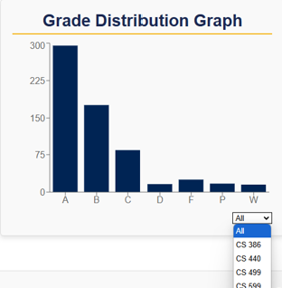

## **D.6 Implementation 2**

---

### **1. Introduction**

For NAU Computer Science students who are looking to enhance their semesterly scheduling experience, Louie’s Ratings is a comprehensive data tool that allows CS students to not only view and examine professor reviews from previous semesters but also the previous grade distributions in a graphical format. Louie’s Ratings is a website that allows NAU CS students to feel more secure and informed about their enrollment decisions based on more accurate and readily available resources regarding classes and professors.

[Link to GitHub repository](https://github.com/jeffreyHoelzel/LouiesRatings)

### **2. Implemented Requirements**

#### **Requirement 1: Password Security**
- **As an NAU student**, I want to ensure that my password is securely stored in the event of a database leak.
- **Issue**: [#106](https://github.com/jeffreyHoelzel/LouiesRatings/issues/106)
- **Pull Request**: [#88](https://github.com/jeffreyHoelzel/LouiesRatings/pull/88)
- **Implemented by**: Jeffrey Hoelzel
- **Approved by**: Sean Golez
- **Print Screen**: N/A

---

#### **Requirement 2: Read Comments**
- **As an NAU student**, I want to be able to read comments left by other students who have taken a specific course and had a specific instructor that I may be taking next semester.
- **Issue**: [#81](https://github.com/jeffreyHoelzel/LouiesRatings/issues/81)
- **Pull Request**: [#100](https://github.com/jeffreyHoelzel/LouiesRatings/pull/100)
- **Implemented by**: Jeffrey Hoelzel
- **Approved by**: Sean Golez
- **Print Screen**:
  

---

#### **Requirement 3: Leave and View Ratings**
- **As an NAU student**, I would like to leave and view ratings on professor/classes so that I gauge the overall consensus on a professor/class, and also leave my opinion.
- **Issue**: [#78](https://github.com/jeffreyHoelzel/LouiesRatings/issues/78)
- **Pull Request**: [#87](https://github.com/jeffreyHoelzel/LouiesRatings/pull/87)
- **Implemented by**: Sean Golez
- **Approved by**: Jeffrey Hoelzel
- **Print Screen**:
  

---

#### **Requirement 4: Filter Grade Distribution**
- **As an NAU student**, I would like to filter the grade distribution charts so that I can see the grade distribution for a specific class and professor.
- **Issue**: [#80](https://github.com/jeffreyHoelzel/LouiesRatings/issues/80)
- **Pull Request**: [#102](https://github.com/jeffreyHoelzel/LouiesRatings/pull/102)
- **Implemented by**: Sean Golez
- **Approved by**: Jeffrey Hoelzel
- **Print Screen**:
  

---

#### **Requirement 5: View Professors for a Course**
- **As a student**, I want to see which professors are associated with a specific course so that I can decide which professor I want to take the course with.
- **Issue**: [#111](https://github.com/jeffreyHoelzel/LouiesRatings/issues/111)
- **Pull Request**: [#119](https://github.com/jeffreyHoelzel/LouiesRatings/pull/119)
- **Implemented by**: Ayla Tudor
- **Approved by**: Jeffrey Hoelzel
- **Print Screen**:
  

---

#### **Requirement 6: Pass/Fail Rates**
- **As a student**, I want to see a simplified rate of how many students pass and fail courses when taken under a specific professor.
- **Issue**: [#113](https://github.com/jeffreyHoelzel/LouiesRatings/issues/113)
- **Pull Request**: [#93](https://github.com/jeffreyHoelzel/LouiesRatings/pull/93)
- **Implemented by**: Luke Bowen
- **Approved by**: Jeffrey Hoelzel
- **Print Screen**:
  

---

### **3. Tests**

#### **3.1 Unit Tests**

For Louie’s Ratings unit tests, we used the `unittest` Python module, set up a testing database using SQLite, and Docker to develop our automated unit testing.

- **Link to GitHub folder**: [unit-tests](https://github.com/jeffreyHoelzel/LouiesRatings/tree/main/unit-tests)
  
One example of a test case is checking that adding comments worked as expected from a backend perspective.

- **Test Functions**: `test_add_course_comment_successfully(self)`, `test_add_instructor_comment_successfully(self)`, `test_add_course_comment_unsuccessfully(self)`, `test_add_instructor_comment_unsuccessfully(self)`
  
- **Link to module being tested**: [comments.py](https://github.com/jeffreyHoelzel/LouiesRatings/blob/main/service/comments.py)
  
**Print Screen**:
  

---

#### **3.2 Acceptance Tests**

For Louie’s Ratings acceptance tests, we made use of the `unittest` Python module, the Selenium WebDriver, and Docker to develop our automated acceptance testing.

- **Link to GitHub folder**: [acceptance-tests](https://github.com/jeffreyHoelzel/LouiesRatings/tree/main/acceptance-tests)
  
One example of a test case is checking that a specific class page is being loaded properly.

- **Test Function**: `test_class_page(self)`
  
- **Link to class being tested**: [ClassPage.js](https://github.com/jeffreyHoelzel/LouiesRatings/blob/main/web/src/components/ClassPage.js)
  
**Print Screen**:
  

---

### **4. Demo**

[Demo Link](https://www.youtube.com/watch?si=s3-qzR_RZvA-62dz&v=7K_QXD_txz8&feature=youtu.be)

---

### **5. Code Quality**

**Practices and Justifications**:

- **Styling & Coding Conventions**: Our team adopted language-specific styling conventions to ensure a consistent and readable development environment. For example, we adhered to PEP 8 for Python code and followed the Airbnb React/JSX style guide for JavaScript files. Balancing readability and efficiency was always a priority. Clear coding standards played a crucial role in implementing designs effectively, reducing ambiguity, and promoting a shared understanding of best practices across the team.

- **Code Refactorization**: To maintain modularity and reduce complexity, we frequently refactored our codebase. Each module was designed to handle a specific set of functionalities for the overall application. For instance, the search functionality is isolated within dedicated modules for both frontend and backend, ensuring that only these modules contain the core logic for searching. Other modules could utilize the search functionality, but the responsibility for its implementation remained singular and centralized. This approach enhanced maintainability and made it easier to adapt the system to new requirements or features.

- **Code Reviews & Branching**: One of the most important methods we use to ensure high-quality code is the use of code reviews. The process is simple:
  1. Any changes made to the code on your branch that you want to establish as a working feature must go through a pull request into the development branch.
  2. Another team member will review the code, make any requests for you to change something (i.e., styling, logic, etc.), and once all necessary requests have been handled, the pull request may be approved.
  3. At this point, the code is merged into the development branch, where another team member can make necessary database changes (since we use SQLite for development and PostgreSQL for production).
  4. Lastly, a pull request into the main branch is created, which gets reviewed and approved by another team member.

- **Automated Testing**: Upon running the Docker containers, a series of tests are executed to ensure that existing features are working properly even when other features are also implemented.

---

### **6. Lessons Learned**

Our team encountered new challenges during this second release that we overcame and learned from as a group. In our last release, we tended to underestimate the time required for certain tasks. This time, we focused on setting more realistic goals to ensure that our workload was achievable within the given timeframe. This approach helped us focus on the most important features and let go of some less urgent ones. It also meant that we had to work more closely as a team to divide up the work and responsibility for certain tasks. During this second release, our team got better at handling unexpected problems, figuring things out together, and giving each other feedback to improve. These experiences significantly helped us grow as a team and as developers.
